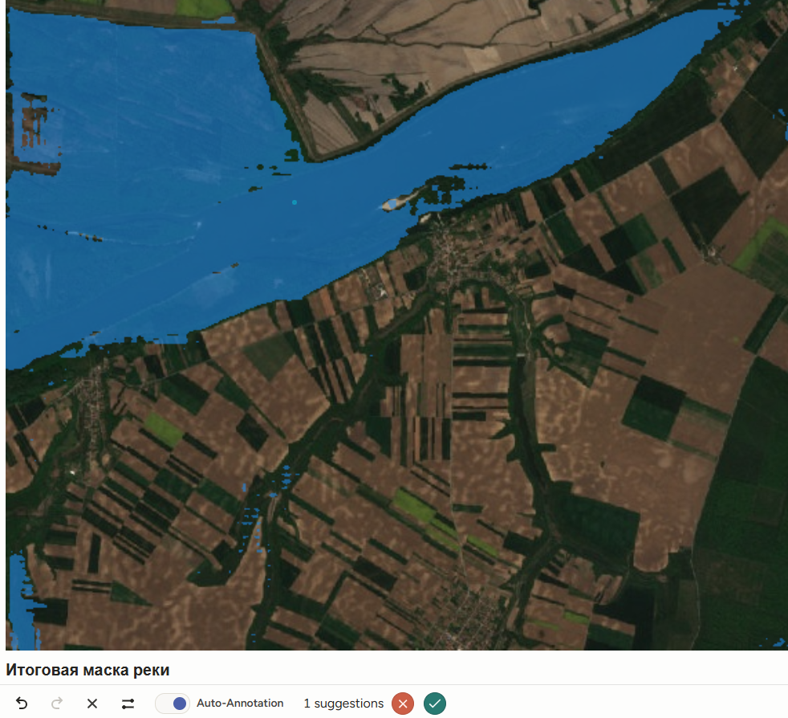
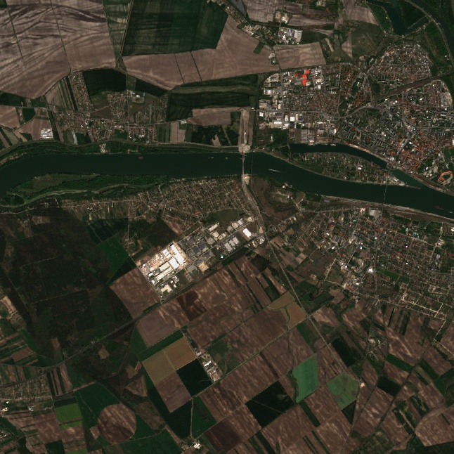
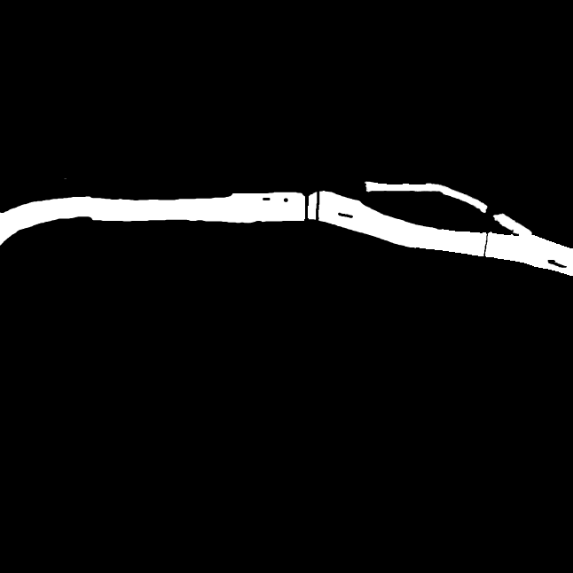

# Инструкция для разметчика

## Как развернуть проект
Поместите выбранные для разметки изображения в директорию:
```cmd
./label-studio-data/images
```
Из корневой директории репозитория выполните следющие команды в терминале:

Для первого запуска контейнера Label Studio:
```docker
docker run --name river-label-studio -it -p 8080:8080 -v "${PWD}\label-studio-data:/label-studio/data" --env LABEL_STUDIO_LOCAL_FILES_SERVING_ENABLED=true --env LABEL_STUDIO_LOCAL_FILES_DOCUMENT_ROOT=/label-studio/data heartexlabs/label-studio:1.20.0 label-studio --host 0.0.0.0
```
Для повторного запуска контейнера Label Studio:
```docker
docker start -ai river-label-studio
```

В случае, если требуется удалить контейнер:
```docker
docker rm -f river-label-studio
```

Чтобы зайти в Label Studio, перейдите по ссылке:
```cmd
http://localhost:8080
```

Создайте окружение python и установите зависимости, создайте tasks.json для автоматического импорта картинок в Label Studio:
```cmd
uv venv --python 3.11
./.venv/Scripts/activate
uv pip install -r requirements.txt
uv run python make_tasks.py
```

Чтобы подключить локальное хранилище с изображениями  зайдите в Label Studio в:
```text
Project -> Settings -> Cloud Storage -> Add Source Storage -> Local Files
```
И укажите:
```text
Absolute local path:
/label-studio/data/images
```

Остаётся подключить `tasks.json`. Для этого
1. Зайдите в Label Studio в свой проект
2. Нажмите `Data Import`
3. Выберите файл `tasks.json`

## Запуск ML backend

В Label Studio откройте `Account & Settings` и скопируйте `Access Token`. Вставьте его в `.env`:

```text
LABEL_STUDIO_API_KEY=ваш_токен
```
Для автоматической предразметки используется модель SA(Segment Anything). Для её активациии, откройте второе окно терминала и выполните:
```cmd
uv run python wsgi.py --host 0.0.0.0 --port 9090
```

В Label Studio откройте `Settings` -> `Machine Learning` / `Model` -> `Connect Model`:

- URL: `http://127.0.0.1:9090`
- включить interactive preannotations;
- нажать `Validate and Save`.


## Общие сведения о датасете
Правила разметки содержатся в файле `labbel_config.xml`.
Датасет взят из https://github.com/radekszostak/sentinel-river-segmentation-dataset/tree/main

Вы участвуете в разметке датасета спутниковых снимков для задачи сегментации рек. Цель разметки - получить маску пикселей, соответствующих видимой поверхности речной воды. По этой маске в дальнейшем можно обучать модель, которая будет автоматически находить реки на спутниковых изображениях.

Качество разметки напрямую влияет на качество модели. Если в маску попадут берега, тени, дороги, облака или растительность, модель начнёт считать эти объекты водой. Если части русла будут часто пропущены, модель будет плохо находить узкие реки, рукава и участки со сложной береговой линией.

Разметка выполняется в Label Studio с использованием масок сегментации. Модель Segment Anything используется только как помощник. Каждую предложенную маску нужно проверить и при необходимости исправить вручную.

Пример SA маски:


Пример провeденной разметки:



## Класс разметки

В датасете используется один класс:

- `river_water` - видимая поверхность воды в русле реки.

Под `river_water` понимаются участки изображения, где уверенно видна речная вода: основное русло, рукава, протоки, старицы, затоны и пойменные водные участки, если они визуально относятся к речной системе.

## Что нужно размечать

Размечайте всю видимую водную поверхность реки:

- широкое основное русло;
- узкие рукава и протоки;
- извилистые участки русла;
- видимые водные части под частичной тенью;
- отдельные фрагменты русла, если река частично закрыта облаком, мостом или растительностью;
- соединённые с рекой заводи и старицы, если они выглядят частью речной системы.

Граница маски должна идти по береговой линии настолько точно, насколько это возможно на данном разрешении снимка.

## Что не нужно размечать

Не включайте в маску:

- берега и прибрежный песок;
- острова, песчаные косы и отмели, если это суша;
- растительность и лес вдоль русла;
- мосты, дороги, здания, корабли и другие объекты на воде;
- тени от облаков, гор, деревьев и зданий;
- облака, снег и лёд;
- тёмную влажную почву, если вода не видна явно;
- озёра, море или водохранилища

## Порядок работы в Label Studio

1. Откройте задачу в Label Studio.
2. Выберите smart-инструмент `Рамка для Segment Anything` и класс `river_water`.
3. Обведите рамкой реку или её участок.
4. Дождитесь маски, предложенной моделью Segment Anything.
5. Подтвердите предсказанную область галочкой вне изображения.
6. Исправьте оставшиеся ошибки обычной кистью или ластиком.
7. Нажмите `Submit`.

## Общие требования к качеству

Маска должна покрывать только видимую воду. Не дорисовывайте реку под облаками, мостами, зданиями или деревьями, если вода там не видна.

Если река выходит за границу снимка, маска должна доходить до края изображения и не выходить за него.

Если внутри реки есть остров или сухая коса, не включайте её в маску. В маске должно остаться отверстие или разрыв по суше.

Если река разделена на несколько видимых частей, размечайте все уверенно видимые части одним и тем же классом `river_water`.

Если объект очень маленький и нельзя уверенно понять, река это или нет, лучше не размечать его.


